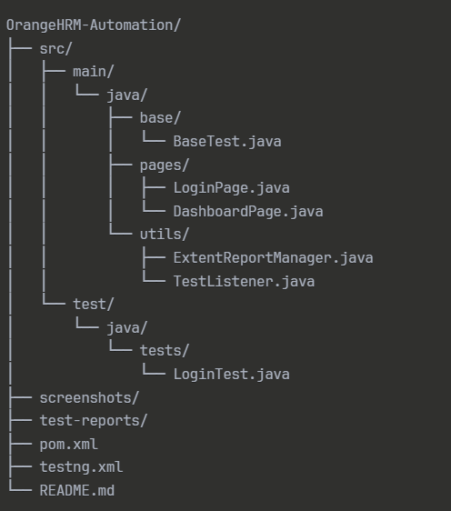

# OrangeHRM Test Automation Framework
# Overview

A robust, scalable test automation framework built with Selenium WebDriver, Java, and TestNG for testing the OrangeHRM application. This framework implements industry best practices including Page Object Model, thread-safe WebDriver management, and comprehensive reporting with 100% test pass rate across multiple browsers.

The system leverages modern automation tools and design patterns to provide reliable, maintainable, and scalable test solutions for web application testing. By combining advanced WebDriver management with detailed reporting capabilities, this framework serves as a foundation for enterprise-level test automation.

Demo Vedio - https://drive.google.com/file/d/1bGtBeW05OQCqUGcJ9DyWuV01I3Ocf_sy/view?usp=sharing

## System Architecture
The framework follows a layered architecture approach with clear separation of concerns:

### Base Layer
WebDriver management and configuration handling

### Page Layer
Page Object Model implementation for maintainable test code

### Test Layer
Test cases and business logic scenarios

### Utils Layer
Reporting, logging, and utility functions

# Technology Stack
## Core Technologies

*  Java 11 - Primary programming language
* Selenium WebDriver 4.26.0 - Browser automation engine
* TestNG 7.10.2 - Testing framework and test management
* Maven 3.x - Build automation and dependency management
* ExtentReports 5.1.2 - Advanced HTML test reporting
* WebDriverManager 5.9.2 - Automatic browser driver management

# Project Structure

# Test Reports and Documentation
### Report Generation
Comprehensive HTML reports are automatically generated after test execution in the test-reports directory.

### Report Features
* Executive summary dashboard with pass/fail statistics
* Detailed test execution logs with timestamps
* Error analysis and stack trace information
* Browser and environment configuration details
* Performance metrics and execution timing

## Sample Test Results
### Executive Dashboard View

### Detailed Execution Analysis

# Test Coverage and Scenarios
## Login Functionality Testing
### Valid Credentials Test
* Validates successful authentication with correct username and password
* Verifies dashboard accessibility after successful login
* Confirms proper user session establishment and management

### Invalid Credentials Test

* Tests authentication failure scenarios with incorrect credentials
* Verifies appropriate error message display to users
* Ensures user remains on login page without unauthorized access

### Empty Fields Validation Test

* Tests form validation for empty credential fields
* Confirms security measures prevent unauthorized system access
* Validates client-side form validation behavior

# Best Practices Implementation
## Design Pattern Implementation
### Page Object Model
* Separates page elements and actions for better maintainability and reusability across test cases.
### Singleton Pattern
* Implements single ExtentReports instance across entire test suite for consistent reporting.
### Factory Pattern
* Enables dynamic WebDriver initialization based on browser parameters and configuration.
##  Thread Safety Architecture
### ThreadLocal WebDriver Management
* Provides isolated WebDriver instances per thread for safe parallel execution.
### ThreadLocal WebDriverWait Implementation
* Ensures thread-safe explicit wait mechanisms across concurrent test execution.
### Parallel Execution Support
* Framework architecture supports concurrent test execution without session conflicts.
## Error Handling and Recovery
### Comprehensive Exception Management
* Implements graceful failure handling with detailed error logging and recovery mechanisms.
### Session Validation
* Performs WebDriver health checks before critical operations to prevent session failures.
### Automatic Recovery Mechanisms
* Includes driver re-initialization capabilities for handling unexpected session terminations.
## Reporting and Analytics
### ExtentReports Integration
* Professional HTML reporting with detailed execution analysis and visual representations.
### Real-time Console Logging
* Provides immediate feedback during test execution with structured logging output.
### Test Result Categorization
* Automatic categorization of test results into Pass, Fail, and Skip status with detailed metrics.
## Configuration Management
### Maven Dependency Control
* Centralized management of library versions and dependencies through Maven configuration.
### TestNG XML Configuration
* Flexible test execution control with parameterized browser selection and test ordering.
### Cross-Browser Parameterization
* Easy browser switching and multi-browser testing through configuration parameters.
## Code Organization Standards
### Separation of Concerns
* Clear package structure with logical separation of test logic, page objects, and utilities.
### Reusable Component Design
* Utility classes and base test implementations for maximum code reusability.
### Maintainable Code Structure
* Clean, well-documented, and structured code following industry standards and conventions.

### License Information
This project operates under the MIT License framework. Complete license details are available in the LICENSE file within the repository.
### Author
Dehani Pathirana

